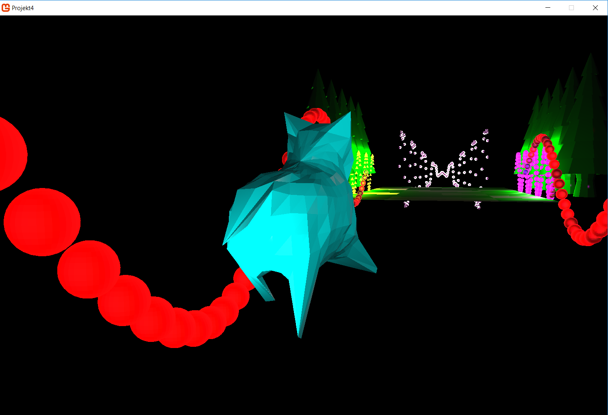
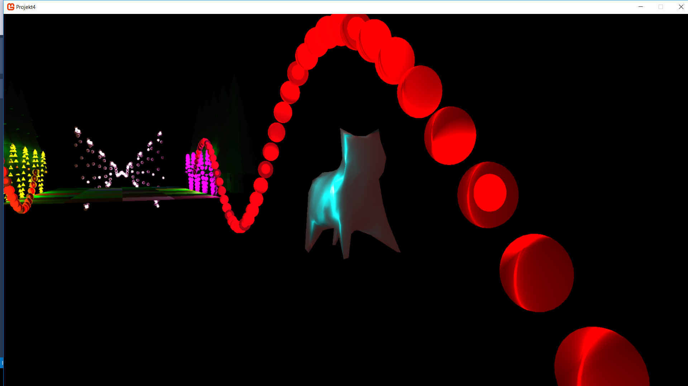

# ChristmasIlluminations3D

A university's project done during Computer Graphics course at Warsaw University of Technology.

The project is done in Monogame. It uses 3 types of shading: flat, Gouraud and Phong.
The scene can be seen via one of three provided cameras.

The cat may be moved by a user.
